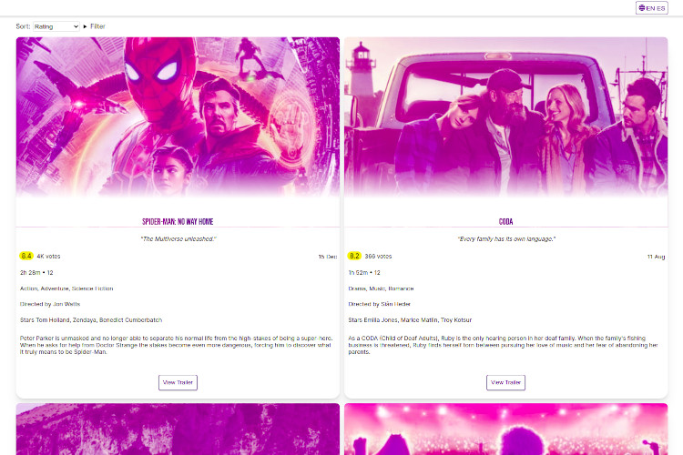
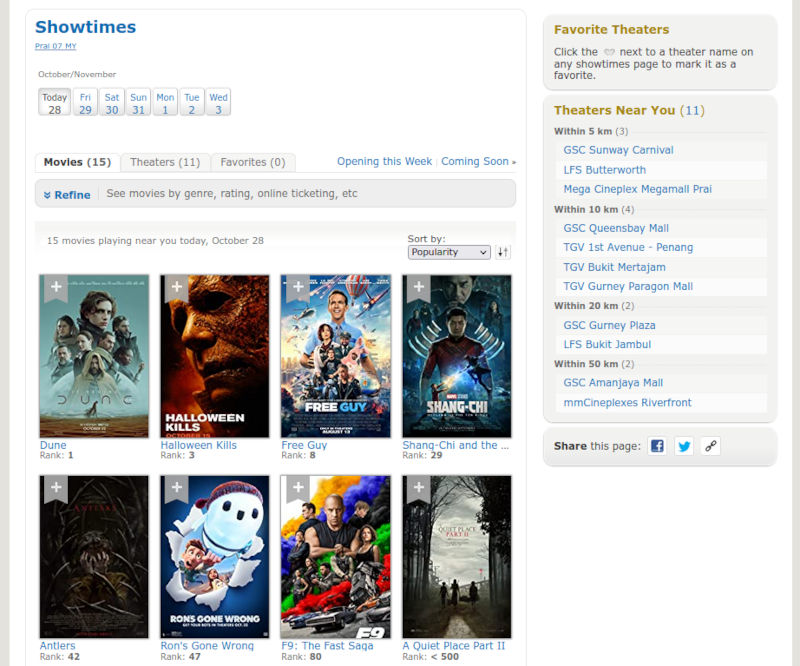
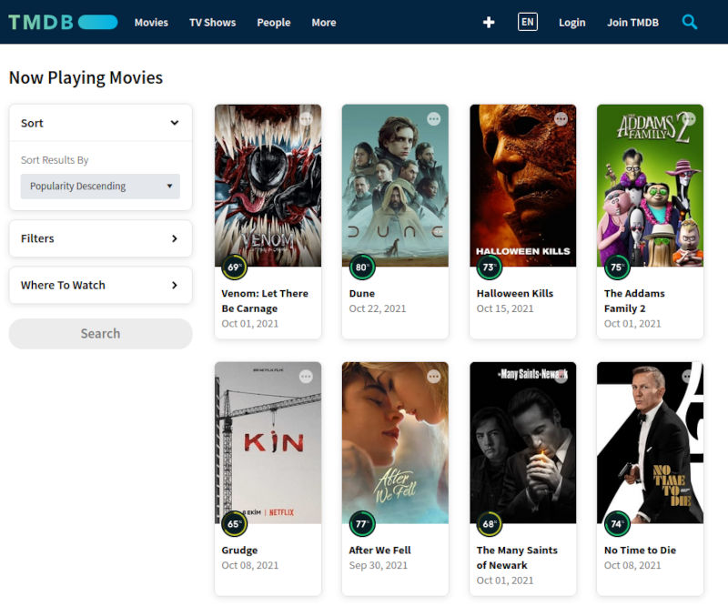

<h1 align="center">

 
 
Now Showing
 
</h1>

<h4 align="center"><em>Preview movies showing in movie theaters in your country</em></h4>
 

Browse the catalogue of movies that are showing in theaters to decide what movie you want to see. The data is provided by [TMDB](https://www.themoviedb.org/).

**Try [the demo](https://now-showing.netlify.app) out!**

## Features

1. The most recent 20 movies in cinemas (movie theaters) are displayed as a list of cards.
1. Each card shows the key info for each movie: title, tagline, rating, number of votes, release date, running time, age certification, genres, directed by, actors (3 leading actors), and description.
1. Ratings are colour coded for quick identification, a rating that is:
	- Greater than or equal 8 is coloured gold,
	- Between 7.9 and 6.5 is coloured silver,
	- Less than or equal to 6.5 and greater than 5.5 is coloured bronze,
	- Less than 5.5 is coloured dark brown.
1. You can click a "Show More" button to show the next most recent 20 movies that were/are showing, if available.
1. The list of movies can be sorted by rating, duration and release date. They are sorted by rating (descending order) by default.
1. The list of movies can be filtered by rating (min and max values).
1. You can view the trailers quickly for each movie in a pop-up custom video player (videos are sourced from YouTube). If there is more than one trailer for a movie, you can cycle through them.
1. The video player has keyboard support for all actions:
	- <kbd>Spacebar</kbd>: Play/pause,
	- <kbd>Right arrow</kbd>: Previous video,
	- <kbd>Left arrow</kbd>: Next video,
	- <kbd>Up arrow</kbd>: Increase volumne,
	- <kbd>Down arrow</kbd>: Decrease volumne.
	- <kbd>Esc</kbd>: Close video player.
1. It has a button in the header that shows which country and language is currently selected. This is not clear from other websites, especially when you visit as a "guest". You can change the country and language, and the selections are stored in the browser (in [`localStorage`](https://developer.mozilla.org/en-US/docs/Web/API/Web_Storage_API)), so they are available the next time you visit the app. The default language is English, and the default country is Ireland.

The data is sourced from the [TMDB API v3](https://developers.themoviedb.org/3/getting-started/introduction). This API has [no rate limiting](https://developers.themoviedb.org/3/getting-started/request-rate-limiting).

## Why?

I made this because I wanted a better way to decide which movie I would like to see in the cinema (movie theater). I found that existing solutions fall short of my expectations.

### Existing solutions

IMDB has an ["In Theaters"](https://www.imdb.com/movies-in-theaters/?ref_=nv_mv_inth) page, which only shows the movies that are *opening this week*. I would rather see *all of the movies* that are showing. You need to go to [the "Showtimes" page](https://www.imdb.com/showtimes/) to see all the movies, and it only shows the bare minimum info: movie title, rank, and a cover image! It does show more info as a tooltip when you hover over it, but you may not stumble upon this. In any case, the tooltip is super slow to load! 🤦

IMDB - Showtimes

[TMDB](https://www.themoviedb.org/) has a ["Now Playing Movies" page](https://www.themoviedb.org/movie/now-playing), which shows a list of movies with the basic info: title, release date, and a cover image.

TMDB - Now Playing Movies

## To run the project

1. [Sign up to TMDB](https://www.themoviedb.org/signup), then go to <https://www.themoviedb.org/settings/api> to create an API key.
1. Clone this project.
1. Create a new file called `.env` and add it to the project root folder. This is where we will store the API key. This follows [Vite's conventions for environment variables](https://vitejs.dev/guide/env-and-mode.html#env-files). Add the variable `VITE_API_KEY=123` replacing "123" with your actual API key.
1. Go to the command-line, `cd` to to the project folder, and run the command `npm i` to install the project dependencies.
1. Now, run the command `npm run dev` and the app should be running at <http://localhost:3000/>.

## Testing

Unit tests are written with Jest and can be found in the *test/unit* folder. You can run `npm run test` on the command-line to run the tests.

I spoke about how to set Jest up with a Svelte project in this article - [Testing a Svelte app with Jest](https://www.roboleary.net/2021/11/18/svelte-app-testing-jest.html).

## Performance and quality review

The entire app is approximately 23KB gzipped (HTML, CSS, and JS). I guess this is a lot smaller than what other websites are shipping!

I deployed the app to Netlify, and after running [Lighthouse](https://developers.google.com/web/tools/lighthouse/) a few times, these are the **median scores for mobile**:

- Performance: 90
- Accessibility: 100
- Best Practices: 100
- SEO: 100

## Deploy the project

If you want to deploy this as a public website, keep in mind that **environment variables are used in the build process**. So, the TMDB API key could be found by someone who inspects the source code in the browser.

**In this case, it is not that big a deal that other people can see the API key, since there is no rate limiting on the API. Generally though, you would protect the key by moving the API calls into serverless functions or a small backend.**

To build the project, you can run `npm run build` and the generated files will be put into the `dist` folder. You can grab this folder and upload to your favourite hosting service. [Netlify](https://www.netlify.com/) and [Vercel](https://vercel.com/) have free accounts with generous limits and straightforward deployment.

## Gratitude

If you find this project helpful, please star the repo. 🌟

You can [sponsor me or buy me a coffee on ko-fi](https://ko-fi.com/roboleary). 💸🌈
